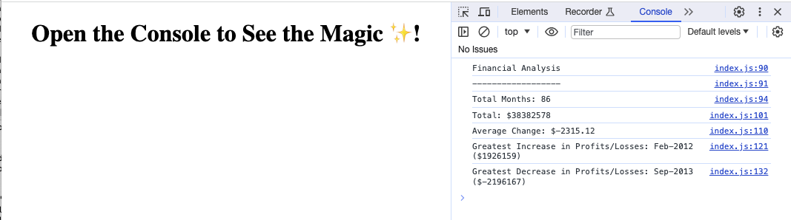

# console-finances

## Description 

This console-finances project was created to develop code to analyse the financial records of a company. A dataset, composed of arrays with two fields—Date and Profit/Losses, has been provided for analysis. The goal is to calculate the number of months in the dataset, the total profit/losses, the average change, and identify the greatest increase and decrease in profit/losses.

The initial starter HTML and JavaScript files were provided, as shown in the second commit. Subsequently, the project was developed, incorporating my newly acquired JavaScript knowledge. Below, I've highlighted the integration of these skills within the project:
- Use a 'for' loop to add up values in a nested array.
- Use a 'for' loop to add up all the differences between data in a nested array.
- Use a 'for' loop to find the largest and smallest differences between data in a nested array.
- Implement rounding of decimal numbers to their nearest hundredth value.
- Use concatenation to combine strings and variables in the console.
- Access elements of the inner arrays.

The URL of the deployed application: https://itismliu.github.io/console-finances/

The URL of the GitHub repository: https://github.com/ItIsMLiu/console-finances

Screenshot of webpage and console:

## Installation

N/A

## Usage 

Open the Chrome DevTools by pressing Command+Option+I (macOS) or Control+Shift+I (Windows). A console panel should open either below or to the side of the webpage in the browser. There you will see a list of analysis of the financial records as requested.

## Credits

Other resources used as guides:
- Rounding of decimal number to its nearest hundredth value: https://www.w3schools.com/jsref/jsref_tofixed.asp
- access elements of the inner arrays: https://www.elated.com/nested-arrays-in-javascript/#:~:text=To%20access%20the%20elements%20of,element%20of%20the%20pets%20array.

## License

MIT license (Please refer to the LICENSE in the repository).
